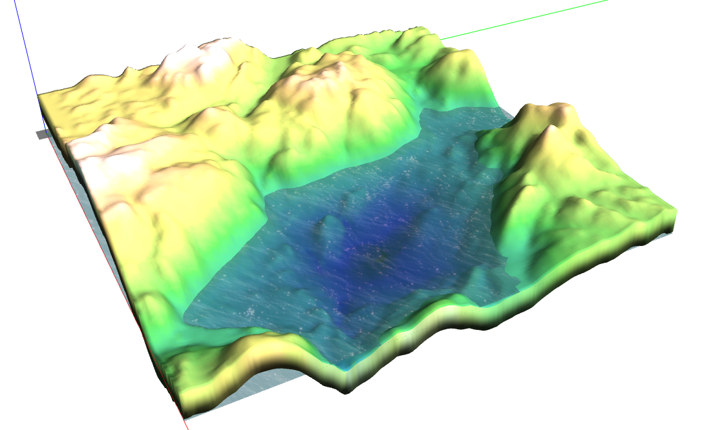
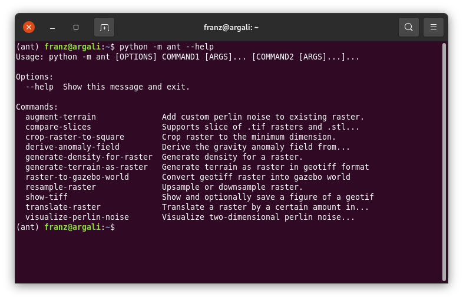
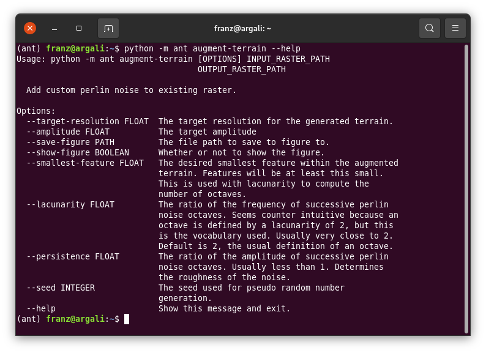
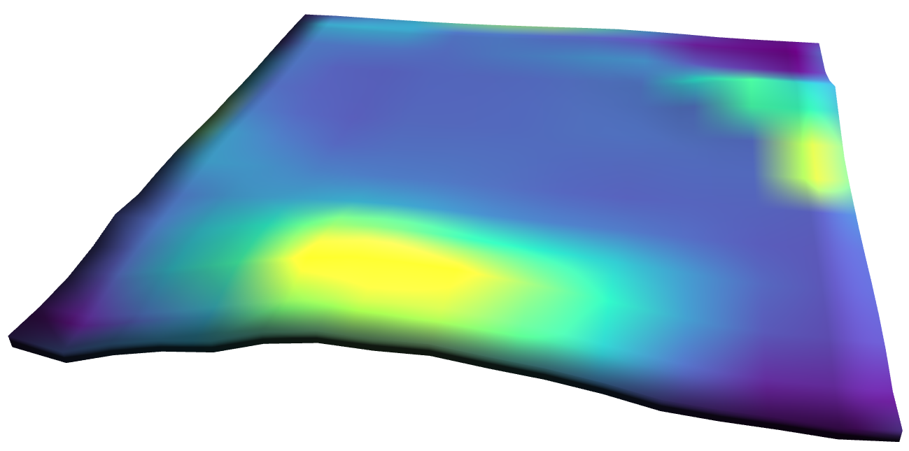
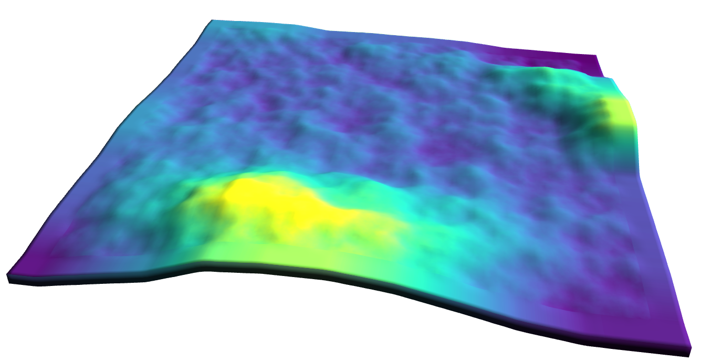
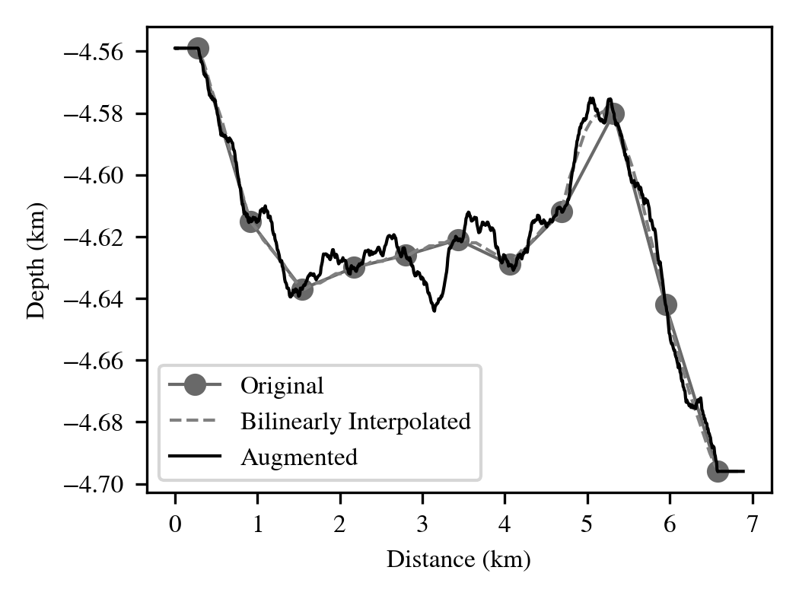
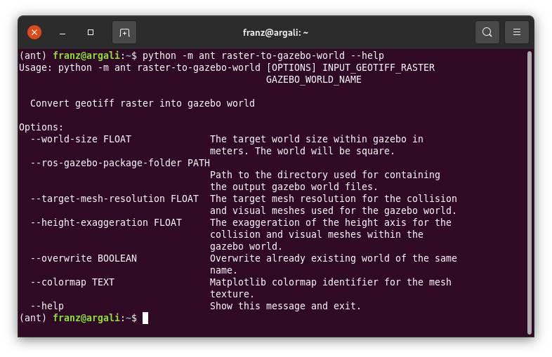

# AUV Navigation Testbed Toolchain



Depicted above is an example of using the `raster-to-gazebo-world` command. The terrain shown is being rendered in the Gazebo environment. The colour map applied as the rendered material is customizable to any colour map that matplotlib supports. The terrain shown above is a 7km by 7km area around the Bedford Basin in Nova Scotia, Canada. The height is exaggerated by ten for demonstration purposes.

## Overview

This python package provides a few tools for working with rasters with regards to:

 * Creating a Gazebo world as a Collada mesh from a raster. The color map overlay on the mesh is customizable to any color map matplotlib supports.
 * Adding coherent noise to existing terrain
 * Cropping rasters to make them compatible with this tool chain
 * Generating synthetic terrain from coherent noise
 * Comparing slices along the diagonal of .stl, .dae, and .tif files to compare rasters. Useful for debugging.
 * Deriving a simplified anomaly field from existing raster
 * Displaying rasters as figures
 * Upsampling or downsampling a raster

This tool is currently under active development so it is subject to change. It is provided as is. The documentation is currently incomplete and in progress.

Feel free to reach out to me with any questions you have about the project. Raising an issue is a great way to contact me.


## Under active development

A good part of the package is still under active development. These are some of the more pressing things:

 * Docstrings (about 2/3 way complete)
 * Command line interface --help (mostly done)
 * Upload package to PyPi (future thing)
 * Expand README to include all commands and examples
 * License (still contemplating this)
 * Tests (I changed the structure for packaging so paths in current tests are incorrect)

## Requirements

Other than the packages that will be automatically installed by pip, the `raster-to-gazebo-world` command needs the `blender` executable on the PATH. This is because the blender API is used to create the Collada mesh from the raster that becomes the visual and collision meshes in the Gazebo world.


## Quick start

Clone the package:

```
git clone https://github.com/franzheubach/ant-cli
```

Install the package (requires python >= 3.6):

```
python -m pip install ant-cli
```

Print available commands:

```
python -m ant --help
```



## Augment existing terrain with coherent noise



The `augment-terrain` command allows adding coherent noise to existing terrain to add detail. The command adjusts the parameters used for the Perlin noise overlay by the desired smallest guaranteed terrain feature, and the persistence between octaves. Number of octaves is calculated using the smallest desired feature. **If original measurement integrity is to be maintained the lacunarity must be a multiple of two so successive Perlin noise functions zero crossing line up.** The base period used for the first Perlin noise function is determined by the original resolution of the raster so zero crossings are lined up with original measurements.

The input raster must be square. The command will generate a figure to visualize  the output raster. Whether a figure is saved and whether it is automatically displayed once the command finishes is controlled by the command line options with those same names. Finally, the target resolution of the final raster can be set. Make sure this target resolution is small enough to resolve your smallest features.

### Example

Below is a non-augmented 5km by 5km section of bathymetry with a resolution of approximately 500m that we would like to use. We would also like to keep the integrity of the original 11 by 11 grid of measurements. These seascapes were rendered in Gazebo simulation environment using the `raster-to-gazebo-world` command.



Five octaves of additional Perlin noise with a base amplitude of 150 meters provides terrain variation between the original measurements. This gives us a seascape with more detail for use in our simulation environment while keeping the original measurements at the original measurement positions unchanged.



We can verify that the measurements are unchanged using the `compare-slices` command. As input arguments it takes any number of STL, Collada, and GeoTIFF files and compares the terrain height along the main diagonal. The output is a simplified figure that compares the height values along the main diagonal. Shown is a customized version of this graph for the OCEANS 2021 paper.



The figure shows that the terrain variation does not affect the original measurements while varying the terrain pseudo-randomly in between. Exactly what we hoped to accomplish.

## Create Gazebo world from raster



**The `raster-to-gazebo-world` command requires the `blender` executable to be available on your PATH. Development of this command used the Blender 2.8.2 Python API.**  The command can be used to scale terrain to a desired size using the world size option. If you are already happy with you raster resolution you can set your target mesh resolution to the existing raster resolution. Adjust it to be able keep mesh face count low enough for you computer specifications and your simulation environment.

The ros gazebo package folder is where all the output of this command is placed. The directory structure expected is:

```
$ros-gazebo-package-folder/
    models/
    worlds/
    media/
        materials/
            textures/
```

The collada mesh files, the original raster, the gazebo SDF, and the gazebo config file will be placed in the `models` folder under the specified `$GAZEBO_WORLD_NAME` (command argument). The output file structure will generally look like this:

```
$ros-gazebo-package-folder/
    models/
        $GAZEBO_WORLD_NAME/
            bathymetry.tif (Copied $INPUT_GEOTIFF_RASTER)
            bathymetry_downsampled.tif (Raster after downsampling)
            bathymetry_downsampled_textured.dae (Collada File)
            bathymetry_downsampled_textured.stl
            model.config
            model.sdf
            ${GAZEBO_WORLD_NAME}_colormap.png
            ${GAZEBO_WORLD_NAME}_heightmap.png
    worlds/
        ${GAZEBO_WORLD_NAME}.world
    media/
        materials/
            textures/
                ${GAZEBO_WORLD_NAME}_colormap.png
```

In the working directory you launched the command from you should also see a file `open_${GAZEBO_WORLD_NAME}_in_gazebo.sh`. This bash script should set the correct Gazebo resource paths and open the world within Gazebo for viewing.

If you want to use the Collada file in another simulation environment you need to copy the `bathymetry_downsampled_textured.dae` Collada file and the `${GAZEBO_WORLD_NAME}_colormap.png` color map image file together into the same directory for use by a different program.

During execution this command prints out the script that uses Blender Python API. If you are having problems with the Blender executing the script correctly this is where to start looking for the problem.

An example output of this command is shown as the first figure in the README.

## Citing

If you use this tool for your own work please cite this package in your work. Once I have an official citation available for this work I will add it. For now you can just cite this GitHub repository as a web resource.
